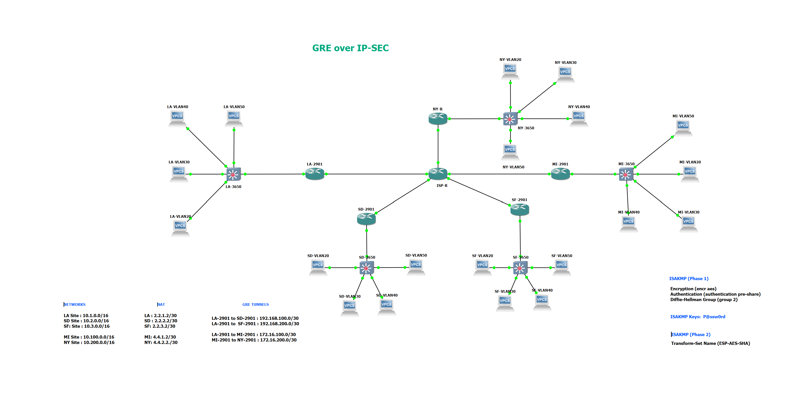

# CBROPS: GRE over IPSec &mdash; Skills Integration Demonstration

## Table of Contents

- [Description](#description)
- [Network Topology](#network-topology)
- [Configuration](#configuration)
  - [Router Setup](#router-setup)
  - [L3 Switch Setup](#l3-switch-setup)
  - [3650 Switch Setup](#3650-switch-setup)
  - [EIGRP Implementation](#eigrp-implementation)
  - [NAT Configuration](#nat-configuration)
  - [Tunnel Implementation](#tunnel-implementation)
- [Usage](#usage)
- [Contributors](#contributors)
- [License](#license)

## Description
This project is a network simulation that demonstrates the configuration of a multi-site network using GRE (Generic Routing Encapsulation) tunnels with IPsec for secure communication between sites. The simulation includes five sites (LA, SD, SF, MI, NY) connected through routers, with additional 3650 switches serving as inter-VLAN routers and participating in EIGRP. EIGRP is employed for efficient routing, and the network setup also involves NAT (Network Address Translation) and IPsec-secured GRE tunnels for connectivity between specific sites.

## Network Topology

The network comprises the following components:

### Tunnel Implementation
IPsec-secured GRE tunnels are established between specific sites for secure and encrypted inter-site routing. The following tunnels are configured:

- LA to SD: 192.168.100.0/30
- LA to SF: 192.168.200.0/30
- LA to MI: 172.16.100.0/30
- MI to NY: 172.16.200.0/30

IPsec is used to secure the GRE traffic between these tunnels, ensuring data confidentiality and integrity during transmission.

## Usage
1. Set up the routers, L3 switch, 3650 switches, and the specified IP addresses based on the given topology.
2. Configure EIGRP on the routers and 3650 switches to enable dynamic routing.
3. Implement NAT for outbound traffic to handle address translation.
4. Establish IPsec-secured GRE tunnels between the specified sites to ensure secure and encrypted communication.

## Detailed Configuration
Detailed configuration files for each device can be found in the `./device-config` directory.

## License
This project is licensed under the [MIT License](LICENSE).
