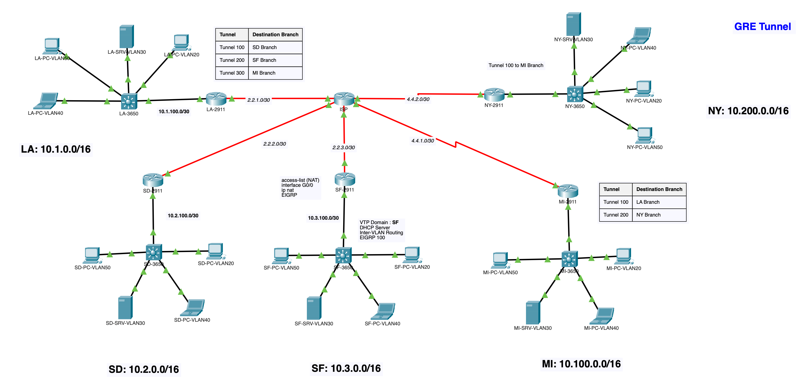

# CBROPS: GRE Skills Integration Demonstration

## Table of Contents

- [Description](#description)
- [Network Topology](#network-topology)
- [Configuration](#configuration)
  - [Router Setup](#router-setup)
  - [L3 Switch Setup](#l3-switch-setup)
  - [3650 Switch Setup](#3650-switch-setup)
  - [EIGRP Implementation](#eigrp-implementation)
  - [NAT Configuration](#nat-configuration)
  - [Tunnel Implementation](#tunnel-implementation)
- [Usage](#usage)
- [Contributors](#contributors)
- [License](#license)

## Description
This project is a network simulation that demonstrates the configuration of a multi-site network using GRE (Generic Routing Encapsulation) tunnels for EIGRP (Enhanced Interior Gateway Routing Protocol) implementation between sites. The simulation includes five sites (LA, SD, SF, MI, NY) connected through routers, with additional 3650 switches serving as inter-VLAN routers and participating in EIGRP. EIGRP is employed for efficient routing, and the network setup also involves NAT (Network Address Translation) and GRE tunnels for connectivity between specific sites.

## Network Topology

The network comprises the following components:

### Sites and Networks

| Site | Network         |
|------|-----------------|
| LA   | 10.1.0.0/16     |
| SD   | 10.2.0.0/16     |
| SF   | 10.3.0.0/16     |
| MI   | 10.100.0.0/16   |
| NY   | 10.200.0.0/16   |

### Router Public Addresses

| Site | Public Address |
|------|----------------|
| LA   | 2.2.1.2/30     |
| SD   | 2.2.2.2/30     |
| SF   | 2.2.3.2/30     |
| MI   | 4.4.1.2/30     |
| NY   | 4.4.2.2/30     |

### 2911 to 3650 P2P Connection

| Site | Interface       |
|------|-----------------|
| LA   | 10.1.100.1/30   |
| SD   | 10.2.100.1/30   |
| SF   | 10.3.100.1/30   |
| MI   | 10.100.100.1/30 |
| NY   | 10.200.100.1/30 |

## Configuration
### Router Setup
Each site's router is connected to an ISP router using public addresses. Routers' G0/0 interfaces are connected to an L3 switch.

### L3 Switch Setup
The L3 switch facilitates connectivity between routers and performs inter-VLAN routing.

### 3650 Switch Setup
The 3650 switches serve as inter-VLAN routers, VTP servers, and participate in EIGRP. Unused ports are configured for testing purposes:
- Access ports are configured for each VLAN.
- Unused ports are shut down and configured as access ports with an unused VLAN assignment.

### EIGRP Implementation
EIGRP is used for dynamic routing within the network, allowing routers and 3650 switches to share routing information and choose optimal paths for data transmission.

### NAT Configuration
Network Address Translation (NAT) is implemented to translate private IP addresses to public IP addresses for outbound traffic.

### Tunnel Implementation
GRE tunnels are established between specific sites for dynamic inter-site routing. The following tunnels are configured:

- LA to SD: 192.168.100.0/30
- LA to SF: 192.168.200.0/30
- LA to MI: 172.16.100.0/30
- MI to NY: 172.16.200.0/30

## Usage
1. Set up the routers, L3 switch, 3650 switches, and the specified IP addresses based on the given topology.
2. Configure EIGRP on the routers and 3650 switches to enable dynamic routing.
3. Implement NAT for outbound traffic to handle address translation.
4. Establish GRE tunnels between the specified sites to ensure secure communication.

## Detailed Configuration
Detailed configuration files for each device can be found in the `./device-config` directory.

## License
This project is licensed under the [MIT License](LICENSE).
